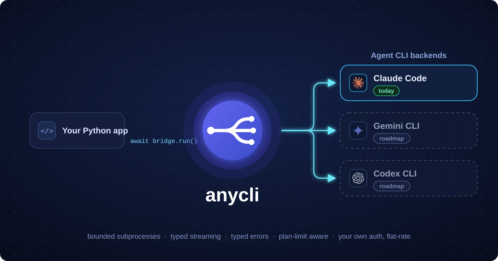

<h1 align="center">
  &nbsp;anycli
</h1>

<p align="center"><b>Drive local agent CLIs from async Python, on the subscription you already pay for.</b></p>

<p align="center">One <code>run()</code> call from your scripts, backends, or CI. Typed streaming out. Flat-rate tokens, not metered API billing.</p>

<p align="center">
  <a href="https://github.com/AtharvaJaiswal005/anycli/actions/workflows/ci.yml"></a>
  <a href="https://github.com/AtharvaJaiswal005/anycli/blob/main/pyproject.toml"></a>
  <a href="LICENSE"></a>
</p>

<p align="center">
  
</p>

anycli wraps an agent CLI already installed on your machine (Claude Code first) behind a single typed surface: `Bridge.run()` today, `session()` / `resume()` next. Underneath sits CLI-agnostic middleware built to survive production: bounded subprocesses, hard turn lifetimes, typed streaming chunks, typed errors, and retry only where retry is safe.

Where it fits: a code-review bot on your repos, a "fix this ticket" endpoint in an internal tool, a CI step that triages failures, a batch job sweeping a backlog — anything that wants a coding agent behind an API instead of a terminal.

## Why anycli

Agent CLIs like Claude Code run on a subscription you already pay for. anycli lets you automate them from Python (batch jobs, web backends, pipelines) without switching to per-token API billing. Agentic work is token-hungry. On a subscription, the marginal cost of a run is zero until you hit your plan window; the flip side is that throughput is capped by your plan, and the [Honest limits](#honest-limits) section spells that out.

It also guards the expensive footgun. Claude Code's credential precedence puts `ANTHROPIC_API_KEY` above subscription auth, so a stale key in a shell profile or container environment silently switches every run to per-token billing at API rates. Subscribers have burned four figures in days this way. `Bridge` checks for the key at construction and warns before a single run happens; `check_env()` gives you the same findings programmatically.

Your code stays local. The agent CLI runs on your machine, against your files, under your own credentials. anycli adds no network hop: prompts go into a local subprocess and typed output comes back out. That is one fewer compliance surface than designs that ship your repository to a hosted API.

The middleware is the part you would otherwise write yourself, badly, under deadline. A global semaphore bounds live subprocesses (one run = one subprocess). A hard max-lifetime deadline tears down hung or abandoned turns, and subprocesses are reaped on completion, close, cancellation, and abandonment. Transient failures (throttling, overload) are retried with exponential backoff and jitter. A hard plan-limit rejection is never retried: it surfaces as a typed `PlanLimitReached` carrying the reset time, so your app can say "resets at 15:00" instead of returning a 500. `bridge.health()` reports active runs, the cap, and queued waiters.

The surface itself is backend-agnostic. `Bridge.run()` is the same call regardless of which agent CLI sits underneath; backend-specific logic lives in thin adapters. Claude Code is supported today, a second adapter is planned for v0.4, and moving between them is a config change rather than a rewrite.

## Honest limits

Read this before building on anycli:

- **Per-user auth, always:** every user runs their own agent CLI on their own credentials. One subscription serving many users, or a user's subscription token running on your server on their behalf, violates the provider's terms of service. anycli never centralizes, stores, or transports credentials, and no design built on it should. This is not supported and never will be.
- **Throughput is capped by each user's plan.** anycli manages that edge (bounded concurrency, a typed `PlanLimitReached` with the reset time) but cannot raise the ceiling.
- **Bring your own auth.** anycli does not log you in; you authenticate the agent CLI itself on each machine that runs it (see [Auth](#auth)).

## Install

anycli is not on PyPI yet; `pip install anycli` will work once the v0.1 release is published. Until then, install from GitHub:

```bash
pip install git+https://github.com/AtharvaJaiswal005/anycli.git
# or with uv
uv add git+https://github.com/AtharvaJaiswal005/anycli.git
```

Python 3.10+. The `claude-agent-sdk` dependency bundles the Claude Code CLI transport, but you still need working auth (see [Auth](#auth)).

## Quickstart

```python
import asyncio

from anycli import Bridge, ClaudeCodeAdapter


async def main() -> None:
    bridge = Bridge(ClaudeCodeAdapter(), max_concurrency=3)

    result = await bridge.run(
        "Summarize what this repository does in two sentences.",
        cwd="/path/to/your/project",
    )
    print(result.text)
    print(result.usage)  # token accounting, if reported
    print(result.total_cost_usd)  # cost as reported by the agent CLI, if any


asyncio.run(main())
```

`run()` also accepts `allowed_tools`, `permission_mode`, `max_turns`, and an `extra_options` dict passed through to the adapter. `cwd` is required (per call or as `default_cwd` on the `Bridge`) because the agent CLI operates on a working directory. `Bridge` also takes `max_turn_seconds` (the hard per-run lifetime) and `warn_on_auth_conflict` (the startup environment check, on by default).

## Streaming

With `stream=True`, `run()` returns an async iterator of typed chunks: `TextDelta`, `ToolUse`, `ToolResult`, ending with a `Result`. Never raw strings.

```python
from anycli import Result, TextDelta, ToolUse

stream = await bridge.run(
    "Find and fix the failing test.",
    cwd="/path/to/your/project",
    stream=True,
)
async for chunk in stream:
    if isinstance(chunk, TextDelta):
        print(chunk.text, end="", flush=True)
    elif isinstance(chunk, ToolUse):
        print(f"\n[tool: {chunk.tool_name}]")
    elif isinstance(chunk, Result):
        print(f"\n[done in {chunk.num_turns} turns]")
```

Iterate the stream to completion or close it promptly. An abandoned iterator holds its concurrency slot until the max-lifetime watchdog reaps the run (or garbage collection closes the iterator, whichever comes first).

## Handling plan limits

All public errors come from `anycli.errors`. Transient failures (`TransientAdapterError`, or 429/529 signals) are retried internally with exponential backoff and jitter. A hard plan-limit rejection is never retried: it is raised as `PlanLimitReached`, with `resets_at` set when the agent CLI reported a reset time.

```python
from anycli import AuthError, PlanLimitReached


try:
    result = await bridge.run("Refactor the config loader.", cwd=project_dir)
except PlanLimitReached as e:
    if e.resets_at is not None:
        print(f"Plan limit hit; resets at {e.resets_at:%H:%M}. Try again then.")
    else:
        print("Plan limit hit; try again later.")
except AuthError:
    print("Agent CLI is not logged in on this machine.")
```

The full hierarchy: `AnycliError` (base) → `AdapterError` (subprocess or protocol failure) → `TransientAdapterError` (safe to retry; anycli retries it for you) and `CLINotFound` (the agent CLI is not installed); plus `AuthError` and `PlanLimitReached` directly under the base.

## Architecture

```
┌────────────────────────────────────────────────────────────┐
│ Public API     Bridge: run() · health()                    │
│                (session() / resume() arrive in v0.2)       │
├────────────────────────────────────────────────────────────┤
│ Middleware     CLI-agnostic: concurrency governor,         │
│                max-lifetime watchdog, streaming            │
│                normalizer, transient-only retry            │
├────────────────────────────────────────────────────────────┤
│ Adapters       thin, one per agent CLI:                    │
│                BaseAgentAdapter → ClaudeCodeAdapter        │
└────────────────────────────────────────────────────────────┘
```

The dividing rule: logic that would be identical for a second agent CLI lives in the middleware; logic that only makes sense for one lives in its adapter. The middleware never imports an SDK and never touches a subprocess; it talks only to `BaseAgentAdapter`. Adapters know five things about their agent CLI: launch, send a turn, stream raw events, capture a session id, and report auth and rate-limit state in normalized form.

## Auth

anycli never manages credentials. You authenticate the agent CLI itself, once, on each machine that runs it.

- **Interactive:** run `claude` and log in with your subscription. Credentials are stored locally by the CLI and refresh automatically.
- **Headless (server, container, CI):** run `claude setup-token` once on a machine with a browser, then set the printed token as `CLAUDE_CODE_OAUTH_TOKEN` in the target environment. Requires a Pro, Max, Team, or Enterprise plan.
- **The footgun, again:** if `ANTHROPIC_API_KEY` is set anywhere in the environment, it wins over subscription auth and every run bills per token at API rates. `Bridge` warns about this at construction (disable with `warn_on_auth_conflict=False`). Unset the key unless per-token billing is what you want.

You can run the same checks yourself:

```python
from anycli import check_env

for finding in check_env():
    print(f"[{finding.level}] {finding.message}")
```

Each user or machine authenticates for itself. Do not ship one person's token to infrastructure that serves other people.

## Roadmap

| Version | Scope | Status |
| ------- | ----- | ------ |
| v0.1 | One-shot `run()` (buffered and streaming), global concurrency cap, hard per-turn lifetime watchdog, subprocess reaping, typed chunks and errors, transient-only retry, startup environment check | **Shipped** |
| v0.2 | Multi-turn sessions: `session()` / `resume()`, session registry (idle TTL + LRU), per-session serialization, durable session store | Planned |
| v0.3 | Robustness: idempotency dedup, rate-limit backpressure, a `doctor` CLI, headless-auth container recipe | Planned |
| v0.4 | Second agent CLI adapter | Planned |

## Contributing

See [CONTRIBUTING.md](CONTRIBUTING.md) for setup, test tiers, and style rules. The short version:

```bash
uv sync
uv run pytest                    # unit tests: no real CLI, no auth needed
uv run pytest -m integration     # real agent CLI + real auth, local only
uv run ruff check . && uv run ruff format .
uv run pyright
```

Unit tests run against a fake adapter — deterministic, no subprocesses, no credentials. Integration tests launch the real agent CLI and are safe to run against a personal subscription (small prompts, low turn caps).

## License

MIT. See [LICENSE](LICENSE).
